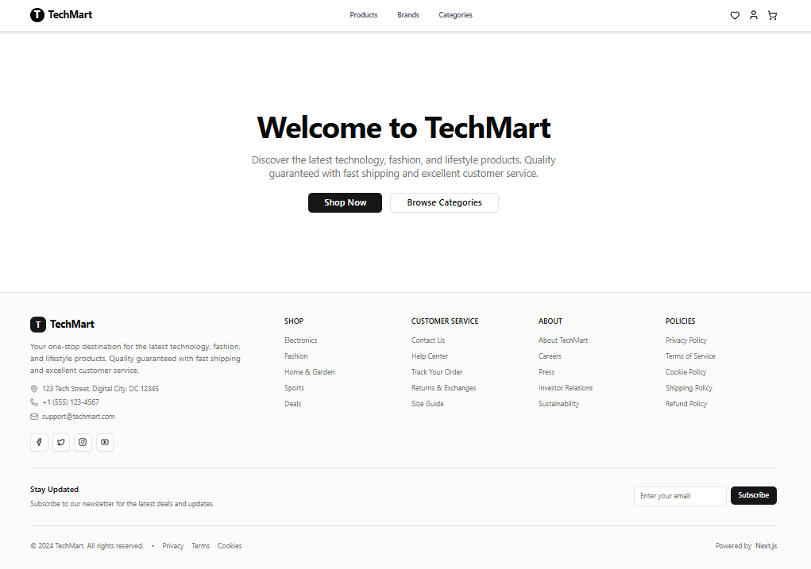
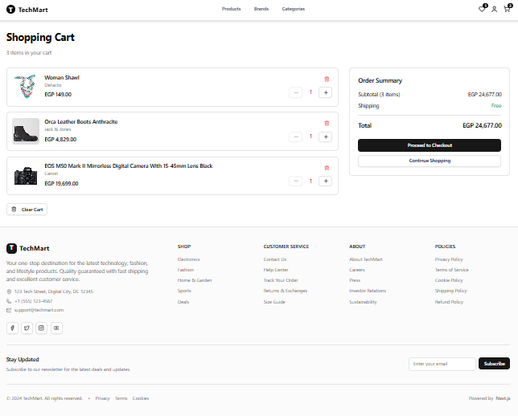
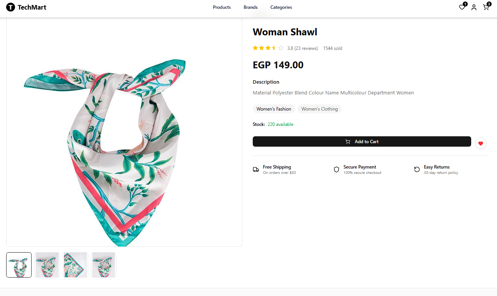

# 🛒 TechMark – Modern E-commerce Platform

TechMark is a full-stack e-commerce web application built with **Next.js**, designed to deliver a smooth and modern online shopping experience.

The project includes authentication, product browsing, cart system, wishlist, and checkout flow with a clean and responsive UI.

---

## ✨ Features

- 🔐 User Authentication (Login & Register)
- 🛍️ Browse Products by Categories & Brands
- 🔍 Product Details Page
- 🛒 Shopping Cart System
- ❤️ Wishlist Functionality
- 💳 Checkout Process
- 📦 Orders Management
- ⚡ Fast and responsive UI
- 📱 Fully responsive design (Mobile + Desktop)

---

## 🛠️ Tech Stack

- Next.js (App Router)
- React.js
- TypeScript
- Tailwind CSS
- Context API (State Management)
- REST API Integration

---

## 📁 Project Structure
src/
├── app/ # Pages (Next.js App Router)
├── components/ # Reusable UI components
├── context/ # Global state (Cart & Wishlist)
├── interfaces/ # TypeScript types
├── lib/ # Utility functions
├── types/ # Type definitions   


---

## ⚙️ Installation & Setup

Clone the repository:

```bash
git clone https://github.com/AbdelrahmanDaify/TechMark.git


Install dependencies:
npm install


Run development server:
npm run dev


Open:
http://localhost:3000


🚀 Build for Production
npm run build
npm start


## 📸 Screenshots

### 🏠 Home Page


### 🛒 Cart Page


### 📦 Product Page

